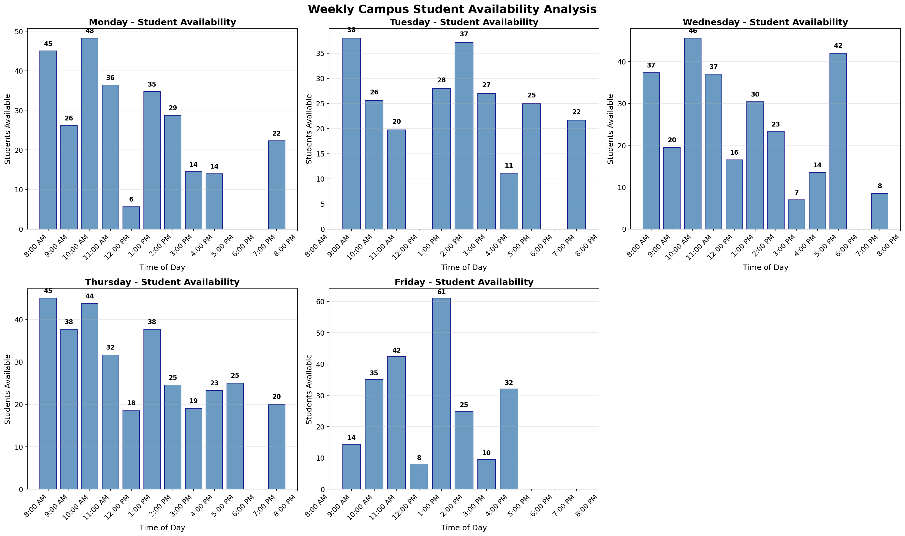
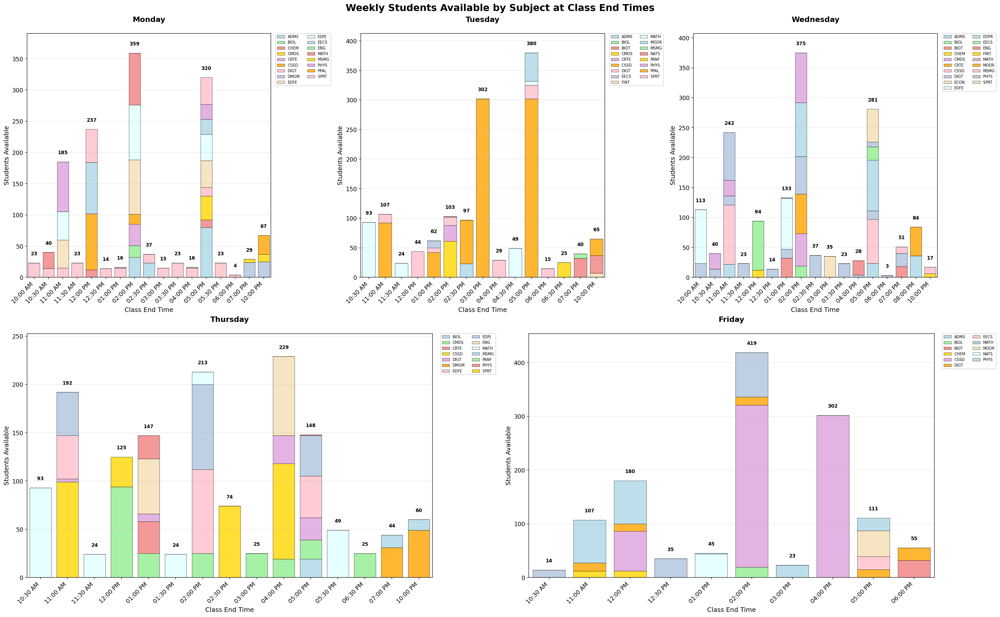

## Campus Class Availability Analytics (Python)


### What this project does
Analyze university timetable snapshots to understand when students are most and least available across the week. The analysis aggregates enrollments at class end times, by subject and by day, and produces clear visualizations and console summaries you can use for event planning, staffing, outreach, or space optimization.

### Primary purpose
Determine the best times to host on‑campus events based on when the fewest students are in class. The source data are Excel timetable spreadsheets exported to CSV for each weekday in this repository.

### Data sourcing and extraction (from Excel)
- Open the weekly timetable spreadsheets in Excel
- Keep the columns needed for analysis: `Day`, `Hour` (start), `Dur.` (minutes), `Enr Count`, `Subj`
- Ensure `Hour` uses 24‑hour format (e.g., `13:30`) and `Dur.` is numeric minutes
- Export each weekday to CSV → `20250818 Calendar Snapshot(<DAY> FY).csv`
- The Python scripts load these CSVs and perform the transformations and visualizations reproducibly

### Why this is relevant for Data Analyst roles
- **Data wrangling**: parse time columns, engineer features (duration, end times, 30‑min rounding), reshape with pivot tables
- **Aggregation and reporting**: compute per-hour means/totals and identify peak/low activity using quantiles
- **Visualization**: generate stacked and grouped bar charts for multivariate comparisons
- **Reproducibility**: simple Python scripts, `requirements.txt`, instructions to run end‑to‑end

## Repository structure
- `main.py`: Creates day-by-day bar charts of average students in class by hour and prints peak/low activity windows
- `total_students_available.py`: Builds stacked and grouped bar charts of students available at class end times by subject; prints detailed per-time and per-subject breakdowns
- `requirements.txt`: Python package dependencies
- `20250818 Calendar Snapshot(<DAY> FY).csv`: Source timetable snapshots for Monday–Friday
- Output images (generated when you run the scripts):
  - `weekly_enrollment_analysis.png`
  - `total_students_available.png`
  - `total_students_available_grouped.png`

Note: `.gitignore` currently excludes `*.csv` and `*.png` to keep the repo light. Remove those lines if you want to commit data and figures.

## Data dictionary (selected columns)
- **Hour**: Class start time in `%H:%M` (24h)
- **Dur.**: Duration in minutes
- **Enr Count**: Enrollment count for the meeting
- **Day**: Weekday code (e.g., M, T, W, R, F)
- **Subj**: Subject code (e.g., ADMS, EECS, DIGT)
- Other columns (e.g., `Fac`, `Crs Num`, `Room`) are available for richer analysis but not all are used in the baseline scripts

## Methods at a glance
1) Parse `Hour` to integer hours and convert `Dur.` to hours
2) Compute `End Hour = Hour + Duration` and round to the nearest 30 minutes (`End Hour Rounded`)
3) Aggregate enrollments:
   - `main.py`: mean students in class by hour → availability trends by day
   - `total_students_available.py`: sum of enrollments grouped by `End Hour Rounded × Subject` → stacked and grouped comparisons
4) Label totals above bars, harmonize axes, and export high‑resolution PNGs
5) Print console summaries: peak/low windows (quantiles), per-time subject totals, and day totals

### Formulas and transformations
Let:
- \(H_i\) be the class start hour (in hours, parsed from `Hour`),
- \(D_i\) the duration in minutes (from `Dur.`),
- \(E_i\) the enrollment count (from `Enr\ Count`),
- \(s_i\) the subject (from `Subj`).

End time (in hours):
\[ \text{EndHour}_i = H_i + \frac{D_i}{60} \]

Rounded to the nearest 30 minutes:
\[ \text{EndHourRounded}_i = \operatorname{round}\!\left( 2\,\text{EndHour}_i \right) / 2 \]

Total students by subject at a given rounded end time \(t\):
\[ S_{t,\,\text{subject}} = \sum_{i:\ \text{EndHourRounded}_i = t,\ s_i=\text{subject}} E_i \]

Total students released at time \(t\):
\[ T_t = \sum_{\text{subject}} S_{t,\,\text{subject}} \]

Hourly in‑class average used for day trends (`main.py`): for day \(d\) and hour \(h\),
\[ \overline{E}_{d,h} = \frac{1}{N_{d,h}} \sum_{i:\ \text{day}=d,\ H_i=h} E_i \]

Peak/low activity thresholds per day (to flag good event windows):
\[ \text{PeakThreshold}_d = Q_{0.75}\big(\overline{E}_{d,h}\big), \quad \text{LowThreshold}_d = Q_{0.25}\big(\overline{E}_{d,h}\big) \]

Best event windows are those hours or end‑times where counts are \(\le \text{LowThreshold}_d\).

## Setup
1) Create and activate a virtual environment (recommended)
```bash
python3 -m venv venv
source venv/bin/activate  # Windows: venv\Scripts\activate
```
2) Install dependencies
```bash
pip install -r requirements.txt
```

## Running the analyses
- Generate per‑day availability bars and summary
```bash
python main.py
```
Outputs:
- Image: `weekly_enrollment_analysis.png`
- Console: peak/low hours and all active hours per day

- Generate per‑subject availability at class end times (stacked + grouped) and detailed breakdowns
```bash
python total_students_available.py
```
Outputs:
- Images: `total_students_available.png`, `total_students_available_grouped.png`
- Console: per‑time totals by subject, day totals, and subject breakdowns

If your CSVs are in another folder, update the `csv_files` mapping at the top of each script.

### Sample output figures





If the images do not appear after pushing to GitHub, remove the `*.png` ignore rule in `.gitignore` or place the figures in a tracked folder (e.g., `docs/`).

## Example insights you can extract
- Identify windows with the highest/lowest student activity to schedule events or outreach
- Understand which subjects release the largest cohorts at specific times (e.g., big EECS releases at 2:30 PM)
- Compare weekdays to choose the best day for campus engagements

## Extending this analysis
- Split by campus/room/building to understand foot traffic by location
- Replace means with medians or weighted statistics if needed
- Add confidence intervals or compare multiple snapshot dates
- Export tabular summaries to CSV for downstream BI dashboards

## Reproducibility notes
- Scripts are deterministic given the CSV inputs
- Python packages are pinned at major versions via `requirements.txt`
- Figures are regenerated on every run; they are ignored by `.gitignore` by default

## License and attribution
This repository is for analytical demonstration and portfolio use. Data columns shown in code snippets are from timetable snapshots provided alongside the project.


